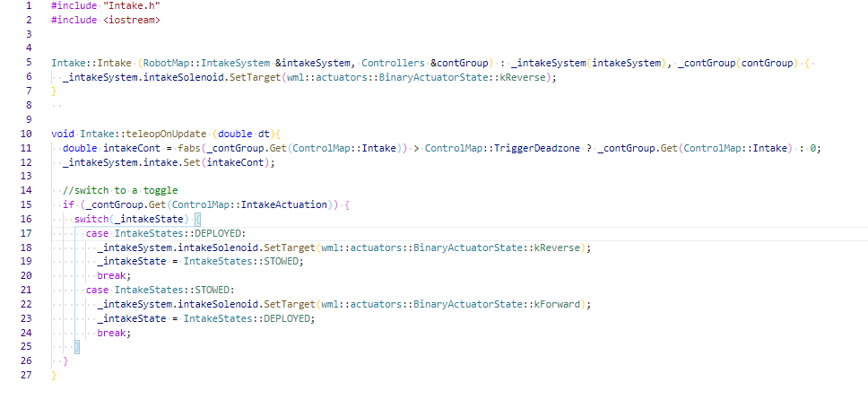
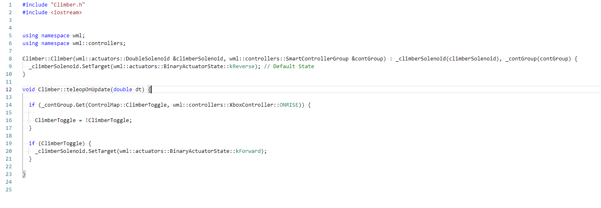
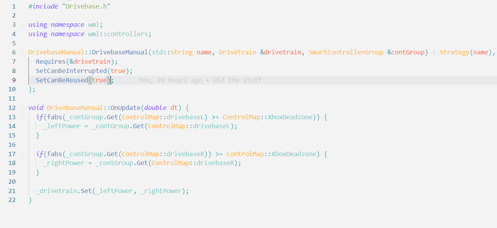

# Current docs

This is our current google doc documentation.

## 2022 Rapid React Protobot Code

## **Overview:**

This code was used to run the 2022 Rapid React protobot of team 4788. The protobot this year consisted of a kit of parts drivebase, an intake, shooter, and climber. 

### **Intake:**

<table>
  <tr>
   <td><strong>Positive</strong>
   </td>
   <td><strong>Negative (things you would change)</strong>
   </td>
  </tr>
  <tr>
   <td>1. Due to the varying positions of the intake, an enum class was used allowing for further variation and automation if needed.

2. Efficient mechanism usage meant that the code was fairly simple and only required some switch cases to work properly.

3. Using the controllers library made it more time efficient to program and reduced the risk of errors.
   </td>
   <td>1. Finding a use for the power variable.

2. 

3.
   </td>
  </tr>
</table>

**Description:**

* The climber is controlled by using B on the co-driver’s xbox controller to toggle the intake and using the left stick’s y-axis to control the speed of the motor, with forwards intaking the balls and backwards outaking the balls
* The intake consists of a primary intaking motor and a solenoid for controlling the actuation. It used to also have an index motor, but it was moved to the shooter due to it being more relevant to that subsystem
* The intake intakes balls from the floor using the intake motor and uses a solenoid to perform its actuation into a deployed and undeployed state, so it can be protected when not in use.

**Image:**

### **Shooter:**

<table>
  <tr>
   <td><strong>Positive</strong>
   </td>
   <td><strong>Negative (things you would change)</strong>
   </td>
  </tr>
  <tr>
   <td>1. 

2.

3.
   </td>
   <td>1.

2.

3.
   </td>
  </tr>
</table>

**Description:**

* _What controllers were used (eg, y xbox button)?_
* _How many solenoids/motors/anything else was used?_
* _What does it do?_

**Image:**

_(Turn code to light mode to take picture)_

### **Climber:**

<table>
  <tr>
   <td><strong>Positive</strong>
   </td>
   <td><strong>Negative</strong> <strong>(things you would change)</strong>
   </td>
  </tr>
  <tr>
   <td>1. The code is simple enough to be flexible towards adjustments and on-the-fly fixes

2. The mechanism only required pistons, which means the code had only required solenoids and made the code fairly simple.
   </td>
   <td>
<ol>

<li>Change all capitalization to lowercase to make it simpler to go around and make adjustments.  
<ol>

<li> Lack of commenting
</li>
</ol>
</li>
</ol>
   </td>
  </tr>
</table>

**Description:**

The A button on the xbox controller is used to actuate the climber. 

The climber has 2 pistons in total.

By pressing the A button once the piston extends and when pressed again it contracts.

**Image:**

### **Drivebase:**

<table>
  <tr>
   <td><strong>Positive</strong>
   </td>
   <td><strong>Negative (things you would change)</strong>
   </td>
  </tr>
  <tr>
   <td>1. Uses Strategies

2. Simple to write autonomous code with

3. Simple to modify if needed
   </td>
   <td>1. Very complex system to learn

2. Harder to catch errors as there are many files

3. Takes more time to set up the drivebase system
   </td>
  </tr>
</table>

**Description:**

* The y-axis on the left and right joysticks on the driver controller are used to drive the robot in a tank drive style
* The drivebase has 2 CIM motors on each side of the drivebase and so it uses 4 CIM motors in total
* The drivebase code allows us to move the robot around the field while both in autonomous and teleoperated modes

**Image:**

